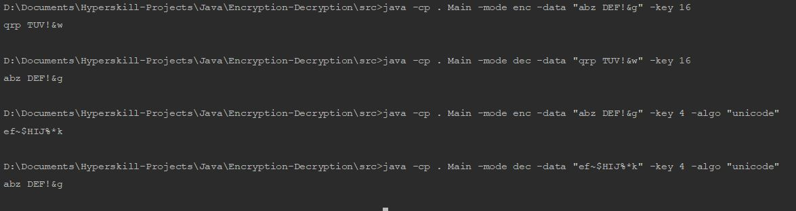

# Encryption Decryption

Implementation of Caesar Cipher and an extended Unicode version of it.
The Caesar cipher encrypts only English letters while the extended Unicode version encrypts any Unicode character.
Check [this](http://practicalcryptography.com/ciphers/caesar-cipher/) link to understand how the ciphers work.

Completed as part of the **Hyperskill JetBrains Academy Java Developer Track**.

Difficulty: Beginner

### Features
* To be run on the command line.
* Validation of user input at every point (*obviously included but it took me time so I'm mentioning it!*)

### Demonstration

The program is written to take inputs from the commmand line. Below are the following options that can be passed:

1. **-mode**: [Default: "enc"] Specify encryption ("enc") or decryption ("dec").
2. **-algo**: [Default: "shift"] Specify if the Caesar cipher algorithm ("shift") or the extended Unicode version ("unicode") is to be used.
3. **-key**: [Default: 0] Specify the shift value to be used for en/decryption
4. **-data**: [Default: ""] Specify the message to be en/decrypted
5. **-in**: [Default: will use **-data** value] Specify the path to the input file. The program will en/decrypt data stored in the file. Note that if **-data** is also passed, this option will be ignored.
6. **-out**: [Default: will print to System.out] Specify the path to the output file. The program will write the en/decrypted message to this file.

Please note these options are case-sensitive. Other options that are passed will be ignored.

**Caution:** Using the extended Unicode version might cause the characters to be encrypted to non-printable characters.

### Dependencies

None; uses built-in Java libraries only

### Requirements

A fairly recent JDK

### Resources

* [Java Official Documentation](https://docs.oracle.com/javase/8/docs/)
* [GeeksForGeeks](https://www.geeksforgeeks.org/)
* [StackOverflow](https://stackoverflow.com/)

### To Do List

- [ ] Implement more (complex) algorithms
- [ ] Change to a GUI